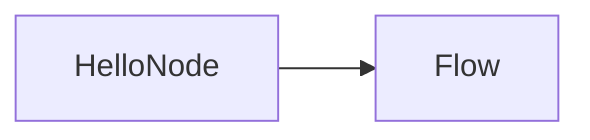
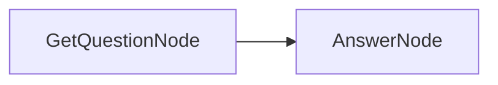
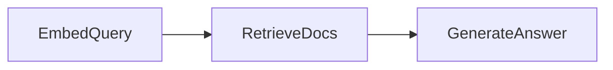
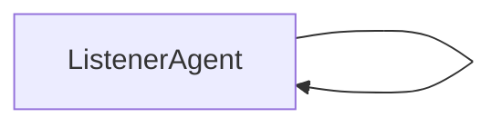
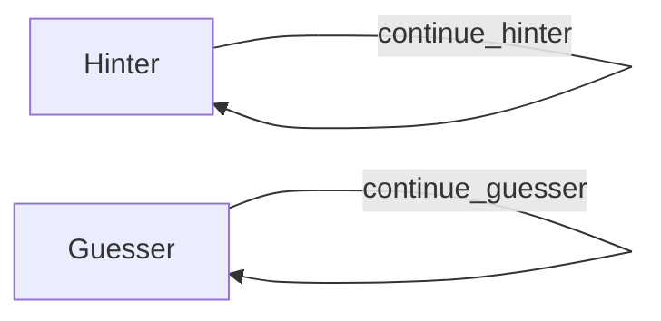

# PocketFlow Ruby

PocketFlow Ruby is a minimal, synchronous workflow library for Ruby 3.4+, **ported from the excellent [PocketFlow project](https://github.com/The-Pocket/PocketFlow)** by [The Pocket](https://www.thepocket.io/). This version draws inspiration primarily from the TypeScript implementation and reimagines it using idiomatic Ruby and plain-old Ruby objects. It aims to maintain API consistency across languages while being lightweight and extensible.

> [!NOTE]
> This library is a community-maintained port and is not affiliated with or officially supported by the original PocketFlow maintainers.

All "parallel" variants currently run sequentially, making it safe to adopt now and evolve toward concurrency later without breaking consumers.

## Getting Started

Add PocketFlow to your `Gemfile`:

```ruby
gem "pocketflow"
```

Then install via Bundler:

```bash
bundle install
```

## Core Abstractions

PocketFlow is built around a handful of simple, composable concepts:

- **BaseNode**: The fundamental unit of work, following a `prep → exec → post` lifecycle. Successor nodes are linked via actions.
- **Node**: Extends `BaseNode` with configurable retry and wait behavior around `exec` (via `max_retries` and `wait`).
- **BatchNode**: Processes an array of items sequentially, applying `exec` to each element.
- **ParallelBatchNode**: API-compatible with `BatchNode`; runs sequentially for now.
- **Flow**: Orchestrates a graph of linked nodes, starting from a root node and following action-based transitions.
- **BatchFlow**: Executes a flow once per parameter set returned by `prep`, useful for batch processing.
- **ParallelBatchFlow**: API-compatible with `BatchFlow`; runs sequentially for now.

## Examples

### Hello World

```ruby
require "pocketflow"

class HelloNode < Pocketflow::Node
  def exec(_)
    puts "hello, world"
  end
end

Pocketflow::Flow.new(HelloNode.new).run({})
```



### Question-Answer (QA) Pattern

```ruby
require "pocketflow"

# Define the nodes
class GetQuestionNode < Pocketflow::Node
  def initialize(question)
    @question = question
    super()
  end
  def exec(_)
    @question
  end
  def post(shared, _prep, question)
    shared[:question] = question
    "default"
  end
end

class AnswerNode < Pocketflow::Node
  def prep(shared)
    shared[:question] || ""
  end
  def exec(question)
    # Simple QA logic / LLM call
    if question.include?("PocketFlow")
      "PocketFlow is a TypeScript library for building reliable AI pipelines."
    else
      "I don't know the answer to that question."
    end
  end
  def post(shared, _prep, answer)
    shared[:answer] = answer
    nil
  end
end

# Build and run the flow
flow = Pocketflow::Flow.new(
  GetQuestionNode.new("What is PocketFlow?")
    .next(AnswerNode.new)
)
shared = {}
flow.run(shared)
puts shared[:answer]
```




### Retrieval-Augmented Generation (RAG) Pattern

```ruby
require "pocketflow"

# Offline indexing
offline_flow = Pocketflow::Flow.new(
  ChunkDocs.new
    .next(EmbedDocs.new)
    .next(StoreIndex.new)
)
shared = { files: %w[doc1.txt doc2.txt] }
offline_flow.run(shared)

# Online query and answer
online_flow = Pocketflow::Flow.new(
  EmbedQuery.new
    .next(RetrieveDocs.new)
    .next(GenerateAnswer.new)
)
shared[:question] = "What is the content about?"
online_flow.run(shared)
puts shared[:answer]

# Combined RAG pipeline
full_flow = Pocketflow::Flow.new(
  ChunkDocs.new
    .next(EmbedDocs.new)
    .next(StoreIndex.new)
    .next(EmbedQuery.new)
    .next(RetrieveDocs.new)
    .next(GenerateAnswer.new)
)
shared = { files: %w[doc1.txt doc2.txt], question: "What is the content about?" }
full_flow.run(shared)
puts shared[:answer]
```

#### Offline Flow


#### Online Flow



### MapReduce Pattern

```ruby
require "pocketflow"

# Summarize multiple files
flow = Pocketflow::Flow.new(
  SummarizeAllFiles.new
    .on("summarized", CombineSummaries.new)
)
shared = { files: { 'file1.txt' => '...', 'file2.txt' => '...', 'file3.txt' => '...' } }
flow.run(shared)
puts shared[:all_files_summary]
```


```ruby
# Map and reduce text transformation
flow = Pocketflow::Flow.new(
  MapChunks.new
    .on("mapped", ReduceResults.new)
)
shared = { text_to_process: 'This is a sample text to process.' }
flow.run(shared)
puts shared[:final_result]
```


### Multi-Agent Pattern

```ruby
require "pocketflow"

# Simple message listener loop
listener = ListenerAgent.new.on("continue", ListenerAgent.new)
flow = Pocketflow::Flow.new(listener)
shared = { messages: ["msg1", "msg2", "msg3"], processed_messages: [] }
flow.run(shared)
puts shared[:processed_messages]
```



```ruby
# Taboo-style hint and guess agents
hinter = Hinter.new.on("continue_hinter", Hinter.new)
guesser = Guesser.new.on("continue_guesser", Guesser.new)
hinter_flow = Pocketflow::Flow.new(hinter)
guesser_flow = Pocketflow::Flow.new(guesser)
shared = {
  target_word: "popsicle",
  forbidden_words: %w[ice cream frozen stick summer],
  past_guesses: [],
  hinter_queue: ["start_game"],
  guesser_queue: [],
  game_over: false,
  max_rounds: 3,
  current_round: 0
}
until shared[:game_over]
  hinter_flow.run(shared)
  guesser_flow.run(shared)

until shared[:game_over]
puts shared[:past_guesses]
```



## Contributing

Contributions and feedback are welcome — please fork the repository and open a pull request.

## License

This project is licensed under the MIT License - see the LICENSE.txt file for details.
